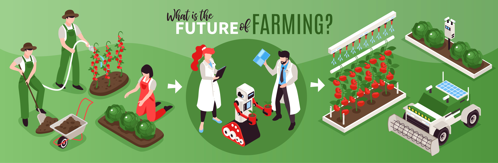

### Hi👋 I am Nguyen Anh Duc from VietNam :revolving_hearts:

- 🔭 I’m currently working on Agricultural Technology.
- 🌱 I’m currently learning Application of Machine learning in high-tech Agriculture. 
- 👯 I’m looking to collaborate on Education and Research partners.
- 📫 How to reach me: [ducna1761@gmail.com](ducna1761@gmail.com)
- 😄 Pronouns: He/His
- ⚡ Fun fact: Digital Strong Farmer :technologist: :man_farmer: :sweat_drops: :ear_of_rice: :four_leaf_clover:
- :tipping_hand_person: [Google Scholar](https://scholar.google.com/citations?user=SKn2P_4AAAAJ&hl=vi&authuser=2) 

:seedling: :potted_plant: :deciduous_tree: :palm_tree: :leaves: :four_leaf_clover: :broccoli: :sunflower: :mushroom: :herb: :cactus: :palm_tree: :tulip: :cherry_blossom: :rose: :hibiscus: :bouquet: :melon: :cucumber: :watermelon: :lemon: :tomato: :strawberry: :cherries: :orange: :coconut:  :avocado: :peanuts: :potato: :corn: :honeybee:	:butterfly: :spider: :lady_beetle: :bug: :maple_leaf:
